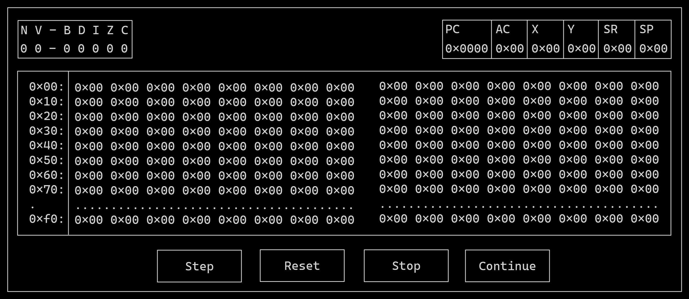

# 6502 Emulator

This repository contains the source code for a **6502 Emulator**, written in **C++**. The emulator
is designed to replicate the functionality of the 6502 microprocessor, which was widely used in
early personal computers.

The 6502 emulator is provided as a static library that can be plugged into any frontend. The
main API provides the following function:

+ `emulator::execute(cpu, program)` that takes an
entire program and the initialised `Cpu` struct, and then executes the whole program,
changing the state of the given `Cpu` as expected.
+ `emulator::execute_next(cpu, program)` single steps the next isntruction on the given `cpu`.

## Getting Started

To get started with the 65k-cpp emulator, clone the repository and follow the instructions below:

The tools needed to build are:

+ `cmake` version 3.28 or above.
+ `ninja` version 1.11 or above.

```bash
git clone https://github.com/matheusgomes28/65k-cpp.git
cmake --preset unix-rel-ninja
cmake --build --preset unit-rel-ninja
```

## Plans

The goal for this project is to have support for all opcodes in ths standard 6502.

In addition, the aim to to provide a couple of front end applications that can step
through 6504 applications, showing state of flags, registers, and memory:



## Contributing

Feel free to submit issues or pull requests. Contributions are welcome!

## License

This project is licensed under the MIT License.
